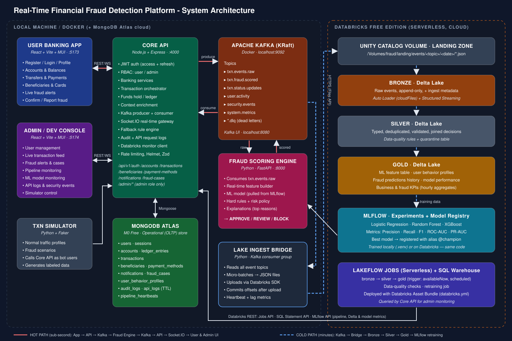
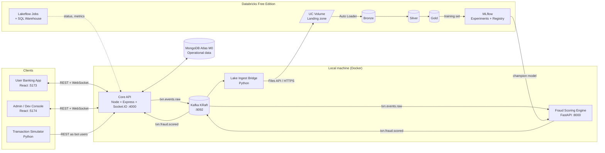
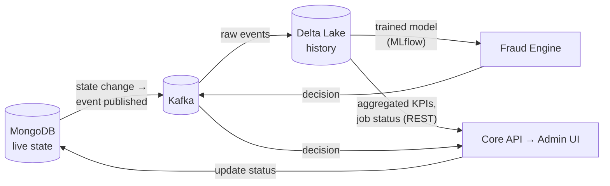
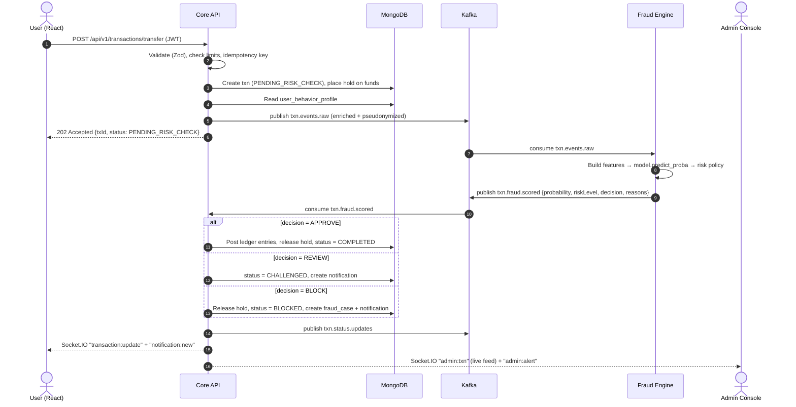
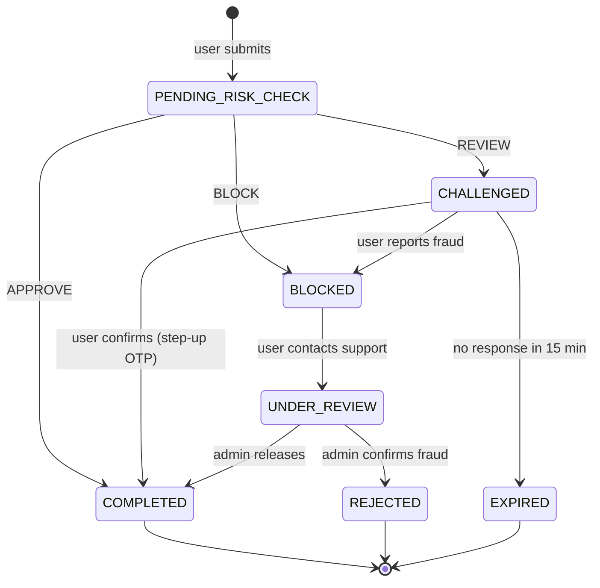

# 🛡️ SentinelPay — Real-Time Financial Fraud Detection Platform

> A banking platform built on MERN with a lakehouse behind it. Every transaction is scored by a machine-learning model **before money moves**. Suspicious activity is blocked or challenged within milliseconds, and the whole system (users, transactions, Kafka, Databricks pipelines, ML models) can be watched live from a separate Admin/Developer console.

**Status:** MVP implemented — MERN API + two dashboards + fraud engine + simulator + ML training + Databricks pipeline. See [SETUP.md](SETUP.md) to run it.

---

## 📑 Table of Contents

1. [System Architecture](#1-system-architecture)
2. [Design Principles](#2-design-principles)
3. [Components & Ports](#3-components--ports)
4. [Data Ownership: MongoDB vs Databricks](#4-data-ownership-mongodb-vs-databricks)
5. [End-to-End Data Flow](#5-end-to-end-data-flow)
6. [Transaction Lifecycle & Fraud Decision](#6-transaction-lifecycle--fraud-decision)
7. [Kafka Topics](#7-kafka-topics)
8. [Delta Lake Medallion Architecture](#8-delta-lake-medallion-architecture)
9. [Machine Learning Pipeline](#9-machine-learning-pipeline)
10. [Transaction Simulator](#10-transaction-simulator)
11. [User-Side Features](#11-user-side-features)
12. [Developer/Admin-Side Features](#12-developeradmin-side-features)
13. [Monitoring & Observability](#13-monitoring--observability)
14. [Security Design](#14-security-design)
15. [Free-Tier Constraints & How We Handle Them](#15-free-tier-constraints--how-we-handle-them)
16. [Development Roadmap](#16-development-roadmap)
17. [Folder Structure](#17-folder-structure)
18. [Glossary](#18-glossary)

---

## 1. System Architecture



> The image above is `docs/architecture.svg`. It is vector-based, so it stays sharp at any zoom level and renders directly on GitHub.

### 1.1 Logical view (Mermaid — renders on GitHub)



### 1.2 Two paths through the system

| Path | Purpose | Latency | Route |
|------|---------|---------|-------|
| 🔴 **Hot path** | Decide whether each transaction is fraud **right now** | ~50–300 ms | App → API → Kafka → Fraud Engine → Kafka → API → Socket.IO → UI |
| 🔵 **Cold path** | Analytics, data quality, feature history, retraining | minutes | Kafka → Bridge → Volume → Bronze → Silver → Gold → MLflow |

**Why two paths?** Databricks Free Edition runs **serverless compute in the cloud**. It cannot reach a Kafka broker on your laptop, and it does not support always-on streaming clusters. So we do what real banks do: the **authorization decision** runs on a low-latency service next to the transaction system, and the **lakehouse** handles large-scale history, feature engineering, monitoring, and model training. The same feature definitions are used in both paths (see §9.3), so training and serving stay consistent.

---

## 2. Design Principles

1. **Money never moves before a decision.** Every outgoing transaction first puts a *hold* on the funds (`PENDING_RISK_CHECK`). The ledger is only debited after an `APPROVE` decision or a confirmed user challenge.
2. **Fail safe, not fail open.** If the ML engine is down or slow (>2 s), a deterministic **fallback rule engine** in the Core API decides. High-value transactions are then challenged instead of approved.
3. **Events are the source of truth for analytics.** Each state change is published to Kafka as an immutable event. Nothing is lost; everything can be replayed into Delta Lake.
4. **Separation of concerns.** User App and Admin Console are two separate React apps, with separate builds, origins, and JWT audiences. They share only the API contract.
5. **Least privilege.** Users can only see their own resources. Admin routes require `role=admin` **and** an admin-audience token.
6. **Reproducible ML.** Every training run is logged to MLflow with parameters, metrics, artifacts, and dataset version. Promotion to production uses a registry alias (`@champion`).
7. **Free-tier friendly.** Small datasets, traditional ML, a single Kafka broker, and serverless jobs that finish quickly.

---

## 3. Components & Ports

| # | Component | Tech | Port | Responsibility |
|---|-----------|------|------|----------------|
| 1 | **User App** | React 18, Vite, MUI, React Query, Socket.IO client | `5173` | Banking UI for customers |
| 2 | **Admin Console** | React 18, Vite, MUI, Recharts, MUI DataGrid | `5174` | Monitoring and operations UI for admins and developers |
| 3 | **Core API** | Node 20, Express, Mongoose, KafkaJS, Socket.IO, Zod, Pino | `4000` | Auth, banking logic, orchestration, WebSocket gateway, admin APIs |
| 4 | **MongoDB Atlas** | MongoDB M0 (free, 512 MB) | cloud | Operational system of record |
| 5 | **Kafka** | Apache Kafka 3.x (KRaft, no ZooKeeper) in Docker | `9092` | Event backbone |
| 6 | **Kafka UI** | provectus/kafka-ui | `8080` | Inspect topics, consumer lag |
| 7 | **Fraud Scoring Engine** | Python 3.11, FastAPI, confluent-kafka, scikit-learn, XGBoost, MLflow | `8000` | Real-time features + model inference + risk policy |
| 8 | **Lake Ingest Bridge** | Python, confluent-kafka, databricks-sdk | — | Ships Kafka events to a Databricks Volume |
| 9 | **Transaction Simulator** | Python, Faker, httpx | — | Generates normal and fraudulent traffic |
| 10 | **Databricks pipelines** | PySpark, Structured Streaming, Auto Loader, Delta Lake | cloud | Bronze → Silver → Gold |
| 11 | **ML training** | scikit-learn, XGBoost, MLflow | local / cloud | Train, evaluate, select, register model |

---

## 4. Data Ownership: MongoDB vs Databricks

This is the most important architectural decision. Each system has one clear job.

### 4.1 MongoDB Atlas — *Operational (OLTP) store: the "live bank"*

MongoDB holds data the application must **read and write in milliseconds** to serve a user request.

| Collection | Contents | Notes |
|------------|----------|-------|
| `users` | name, email, **bcrypt password hash**, role, status (`PENDING`/`ACTIVE`/`DISABLED`/`BLOCKED`), KYC flag, home country, MFA settings | **PII lives only here** |
| `sessions` | refresh-token hash, device fingerprint, IP, user-agent, expiry | Rotated on each refresh; revocable |
| `accounts` | account number, type (checking/savings), currency, `balance`, `heldAmount`, daily limit | Balance changed only through the ledger |
| `ledger_entries` | double-entry debit/credit records | Immutable; balance can be audited |
| `transactions` | id (`TX10001`), type, amount, merchant, beneficiary, channel, geo, device, **status**, risk score, decision, reasons | Current state of each transaction |
| `beneficiaries` | nickname, masked account/IBAN, bank, `addedAt`, `verified` | New beneficiaries are a fraud signal |
| `payment_methods` | card token, **last 4 digits only**, brand, expiry, `isFrozen` | No real card numbers are stored |
| `notifications` | security and transaction notifications, read flag | Pushed live over Socket.IO |
| `fraud_cases` | transaction ref, user action (confirm/report), admin review, resolution | Workflow for disputes |
| `user_behavior_profiles` | rolling avg amount, usual countries, known devices, usual hours, last txn time | Real-time feature cache for scoring |
| `audit_logs` | who did what, when, from where (admin and security actions) | Append-only |
| `api_logs` | method, path, status, latency, userId, requestId | **TTL index (7 days)** to stay under 512 MB |
| `pipeline_heartbeats` | last heartbeat of bridge, engine, jobs | Feeds the admin health page |

### 4.2 Databricks (Delta Lake) — *Analytical (OLAP) store: the "security brain"*

Databricks holds **history at scale**. It is used for analytics, data quality, feature engineering, model training, and model monitoring. It is **never** on the critical path of a user request.

| What goes to Databricks | What does **NOT** go to Databricks |
|-------------------------|-------------------------------------|
| Transaction events (amount, type, channel, merchant category, timestamps) | Passwords / password hashes |
| Pseudonymized user ID (`user_key = HMAC-SHA256(userId, secret)`) | Names, emails, phone numbers |
| Coarse geo (country, city), device hash, IP hash | Raw IP addresses, full card numbers |
| Fraud decisions, scores, reasons, model version | JWTs, refresh tokens, sessions |
| User activity events (login success/failure, beneficiary added, password changed) | Profile photos, addresses |
| Admin actions and case outcomes → used as **labels** | |

> **Privacy by design:** the Core API **pseudonymizes** events before publishing them to Kafka. The lakehouse can find patterns across a user's history without ever learning who the user is. Re-identification is only possible in the Core API, which holds the HMAC secret.

### 4.3 How data moves between the systems



- **MongoDB → Databricks:** never a direct DB-to-DB copy. Every change becomes a Kafka event (like the *transactional outbox* pattern). The bridge lands these events in Delta Lake.
- **Databricks → Application:** only two things flow back: (1) the **trained model** through MLflow, and (2) **read-only monitoring metrics** queried by the Core API through the Databricks REST / SQL Statement APIs.

---

## 5. End-to-End Data Flow

### 5.1 A single transfer, step by step (hot path)



If there is **no score within 2 s**, the Core API runs the **fallback rule engine** (amount thresholds, new beneficiary + large amount, foreign country + new device) and marks the decision `source: "RULES_FALLBACK"`.

### 5.2 Cold path (lakehouse)

```
Kafka topics ──► Lake Ingest Bridge ──► /Volumes/fraud/landing/events/<topic>/dt=YYYY-MM-DD/part-*.json
                                             │
                                             ▼  Auto Loader (cloudFiles) · Structured Streaming · trigger(availableNow)
                                        BRONZE  (raw, append-only)
                                             │  parse · cast · dedupe · validate · join decisions
                                             ▼
                                        SILVER  (clean, conformed)   ──► silver_quarantine (bad rows)
                                             │  windowed aggregates · behavior profiles · labels
                                             ▼
                                        GOLD    (features, predictions, KPIs)
                                             │
                                             ▼
                                        MLflow training → Model Registry (@champion) → Fraud Engine reloads
```

---

## 6. Transaction Lifecycle & Fraud Decision

### 6.1 State machine



### 6.2 Risk policy (configurable from the Admin Console)

| Fraud probability | Risk level | Decision | What the user sees |
|-------------------|-----------|----------|--------------------|
| `< 0.30` | `LOW` | `APPROVE` | ✅ "Transfer completed" |
| `0.30 – 0.70` | `MEDIUM` | `REVIEW` | ⚠️ "Please confirm this transaction" + OTP |
| `≥ 0.70` | `HIGH` | `BLOCK` | ⛔ "Your transaction was blocked because unusual activity was detected." |

**Hard rules override the model** (examples): account status `BLOCKED` → always BLOCK; amount above the account's daily limit → BLOCK; more than 5 failed logins in 10 minutes followed by a transfer → at least REVIEW.

### 6.3 Model output contract

```json
{
  "transaction_id": "TX10001",
  "fraud_probability": 0.92,
  "risk_level": "HIGH",
  "decision": "BLOCK",
  "reasons": ["AMOUNT_12X_USER_AVG", "NEW_COUNTRY", "NEW_BENEFICIARY_LT_1H"],
  "model_name": "fraud_detector",
  "model_version": "3",
  "source": "ML_MODEL",
  "scored_at": "2025-01-01T12:00:00.123Z",
  "latency_ms": 18
}
```

---

## 7. Kafka Topics

| Topic | Producer | Consumers | Key | Purpose |
|-------|----------|-----------|-----|---------|
| `txn.events.raw` | Core API | Fraud Engine, Bridge | `user_key` | Every transaction attempt, enriched |
| `txn.fraud.scored` | Fraud Engine | Core API, Bridge | `transaction_id` | Model decisions |
| `txn.status.updates` | Core API | Bridge | `transaction_id` | Final status changes (confirm, report, admin) → labels |
| `user.activity` | Core API | Bridge | `user_key` | Logins, profile changes, beneficiary adds |
| `security.events` | Core API | Bridge, Core API (admin feed) | `user_key` | Failed logins, blocks, token reuse |
| `system.metrics` | Engine, Bridge | Core API | `service` | Heartbeats, throughput, lag |
| `*.dlq` | any | Admin Console | — | Messages that failed processing |

Partitioning by `user_key` keeps each user's events **in order**, which matters for velocity features.

---

## 8. Delta Lake Medallion Architecture

The lakehouse runs on **Databricks Free Edition (serverless)** against Unity Catalog. Notebooks live in `databricks/notebooks/`, deployed with the Asset Bundle in `databricks.yml` + `resources/medallion_pipeline.yml`.

### Bronze — raw, append-only
- Source: JSON files in the UC Volume `fraud.landing.events`, landed by the Lake Ingest Bridge.
- Ingestion: **Auto Loader** (`cloudFiles`) with schema evolution/rescue, `_ingested_at` + `_source_file` metadata.
- Purpose: immutable replayable history. No filtering, no cleaning.

### Silver — cleaned & conformed
- Type casting, de-duplication (`event`, `transaction_id`, `published_at`), DQ rule (`transaction_id` and `event` must exist).
- Failed rows go to `fraud.analytics.silver_quarantine` — data quality is visible, not silent.
- Joining transaction events with their fraud decisions into one conformed stream.

### Gold — business & ML ready
| Table | Grain | Used by |
|-------|-------|---------|
| `gold_user_behavior` | one row per user: txn counts, avg/max amount, distinct countries | ML training features |
| `gold_fraud_predictions` | one row per model decision | Model monitoring, admin history |
| `gold_fraud_kpis` | hourly: tx counts, blocked/challenged/completed, avg amount | Admin dashboard |

---

## 9. Machine Learning Pipeline

`services/ml/train_model.py` (Python, scikit-learn, XGBoost, MLflow):

1. **Dataset** — auto-downloads the public *creditcard* dataset (OpenML id 1597, 284,807 rows, 0.17% fraud) and caches it locally. Small, free, no signup.
2. **Feature engineering** — `hour`, `is_night`, `log_amount`… consistent with the real-time feature builder in the Fraud Engine (amount-vs-average, new beneficiary, foreign country, night-time, velocity).
3. **Models** — Logistic Regression, Random Forest, XGBoost (skipped automatically if not installed).
4. **Evaluation** — Precision, Recall, F1, **ROC-AUC** and **PR-AUC**; on 0.17%-imbalanced data PR-AUC decides the champion.
5. **MLflow** — every run logs params + metrics; champion exported to `services/fraud-engine/artifacts/model.joblib` + `features.json` + `scaler.joblib`.
6. **Serving** — the Fraud Engine loads the artifact at startup; `/score` returns `fraud_probability`, `risk_level`, `decision`, `reasons`, `latency_ms`.

If the model artifact or the engine is missing, the Core API's **fallback rule engine** keeps decisions flowing (`source: RULES_FALLBACK`), so the platform degrades safely instead of stopping.

---

## 10. Transaction Simulator

`services/simulator/sim.py` registers bot users and mixes traffic profiles:

- **Normal**: $2–120, US, known merchants, web device.
- **Fraud scenarios**: large unknown transfers ($9.5k–24k), foreign-country payments, night drains, new-beneficiary drains, suspicious devices (`emulator`, `rooted-device`).

Expected result: normal traffic → `COMPLETED`, large/foreign/new-payee → `BLOCKED` or `CHALLENGED` with visible reasons. Run with `--loop` for continuous traffic while watching the Admin Console.

---

## 11. User-Side Features

- Register / login / logout (JWT access + refresh), profile visible via `/auth/me`
- Checking account with balance, holds and daily limit
- Transfers & payments with **live fraud decision** (approve / confirm / blocked)
- Beneficiary management
- Transaction history with risk score, decision source and reasons
- Security notifications in-app (Socket.IO push) + fraud banner
- Confirm transaction (challenge flow) and **Report fraud** actions

## 12. Developer/Admin-Side Features

- **User management**: view, approve, disable, block accounts (writes notifications to the user)
- **Transaction monitoring**: full table with user, amount, status, risk %, decision, source, rule reasons
- **Live event feed**: Socket.IO push of every transaction + fraud alert
- **Stats bar**: totals for transactions, completed, challenged, blocked, users, fraud alerts
- **Pipeline tab**: Kafka broker/topics, Delta tables per layer, model/engine health links
- Separate app on port `5174`, admin-only JWT (role enforced server-side)

## 13. Monitoring & Observability

- **API**: morgan request logs, `/health`, structured error responses
- **Kafka**: Kafka UI at :8080 (topics, lag), `*.dlq` topics for failures
- **Fraud Engine**: `/health` (model loaded, feature count), per-decision `latency_ms`
- **Databricks**: job run history (bronze→silver→gold), quarantine table counts
- **MLflow**: experiment `sentinelpay-fraud` — all model runs and metrics
- **Admin dashboard**: real-time aggregates and event feed (above)

## 14. Security Design

- bcrypt password hashing, JWT access (15 min) + refresh (7 days), role-based route guards
- Account status enforcement (`PENDING/ACTIVE/DISABLED/BLOCKED`) on every request
- PII never leaves MongoDB: Kafka events carry pseudonymized IDs; card data stored as last-4 tokens only
- Ledger integrity: immutable holds; money debited only on APPROVE or user-confirmed challenge
- Hard rules override the model (daily limit, velocity, account status)
- Helmet, CORS allow-list, TTL indexes on logs to bound storage

## 15. Free-Tier Constraints & How We Handle Them

| Constraint | Mitigation |
|------------|------------|
| Databricks Free = serverless, no always-on streaming | `trigger(availableNow=True)` micro-batches; bridge lands files instead of a direct Kafka connector |
| Serverless cannot reach localhost Kafka | Bridge process runs on the laptop, uploads via Databricks Files API |
| Atlas M0 512 MB | TTL index on `api_logs` (7 days); events, not raw payloads, in the lake |
| No paid ML serving | FastAPI engine on the laptop, model artifact from MLflow |
| Single Kafka broker (KRaft) | Fine for demo throughput; partitioning scheme is production-shaped |

## 16. Development Roadmap

| Phase | Scope | Status |
|-------|-------|--------|
| 1 | Architecture design | ✅ |
| 2 | Repo/folder structure | ✅ |
| 3 | Environment setup (docker-compose, .env, venv) | ✅ |
| 4 | MERN authentication | ✅ |
| 5 | User banking features | ✅ |
| 6 | Transaction processing + holds/ledger | ✅ |
| 7 | Databricks pipeline (bridge + notebooks + bundle) | ✅ |
| 8 | ML training pipeline | ✅ |
| 9 | Real-time fraud detection (engine + fallback) | ✅ |
| 10 | Developer dashboard | ✅ |
| 11 | Integration testing | ⏳ run `SETUP.md` checklist |

## 17. Folder Structure (as implemented)

```
Fraud-detection-system/
├── README.md                      # this document
├── SETUP.md                       # step-by-step run & verification guide
├── package.json                   # npm workspaces: apps/* + services/api
├── docker-compose.yml             # MongoDB + Kafka (KRaft) + Kafka UI
├── .env.example
├── docs/architecture.svg          # architecture diagram (rendered above)
├── databricks.yml                 # Databricks Asset Bundle (target: dev)
├── resources/
│   └── medallion_pipeline.yml     # job: bronze → silver → gold
├── databricks/
│   ├── notebooks/
│   │   ├── 01_bronze.py           # Auto Loader → bronze_events
│   │   ├── 02_silver.py           # clean/dedupe/DQ + quarantine
│   │   ├── 03_gold.py             # behavior features, predictions, KPIs
│   │   └── setup_catalog.sql      # one-time catalog/schema/volume
│   └── jobs/
│       └── lake_ingest_bridge.py  # Kafka → UC Volume (offsets after upload)
├── services/
│   ├── api/                       # Node/Express + Socket.IO + KafkaJS
│   │   └── src/
│   │       ├── server.js          # app wiring, health, seeding
│   │       ├── config.js  models.js  auth.js  kafka.js  fraudClient.js
│   │       └── routes/ auth.js  banking.js  admin.js
│   ├── fraud-engine/              # FastAPI scorer (model or heuristic)
│   │   └── app.py  requirements.txt
│   ├── ml/                        # train_model.py → MLflow + artifacts/
│   └── simulator/                 # sim.py normal/fraud traffic generator
└── apps/
    ├── user-app/                  # React banking app  :5173
    └── admin-app/                 # React admin console :5174
```

## 18. Glossary

| Term | Meaning |
|------|---------|
| **Hot path** | Synchronous decision flow: API → engine → API → UI (ms) |
| **Cold path** | Async analytics flow: Kafka → bridge → Delta (minutes) |
| **Hold** | Reserved balance while a risk check runs |
| **Challenge** | `CHALLENGED` status requiring user confirmation |
| **Champion** | Best model by PR-AUC, registered in MLflow |
| **Bronze/Silver/Gold** | Raw → cleaned → business-ready Delta layers |
| **DLQ** | Dead-letter topic for messages that fail processing |
