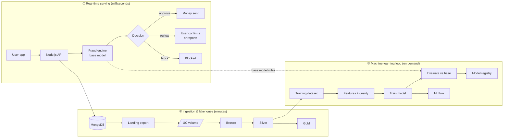
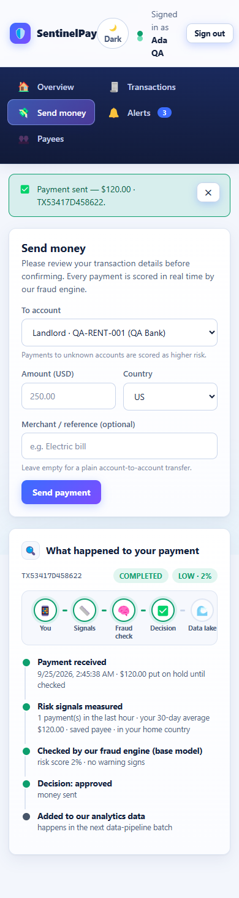
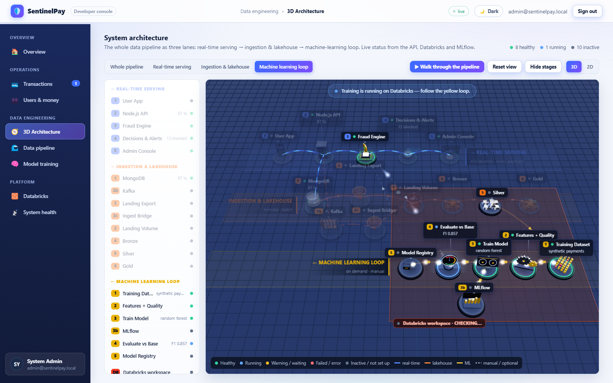
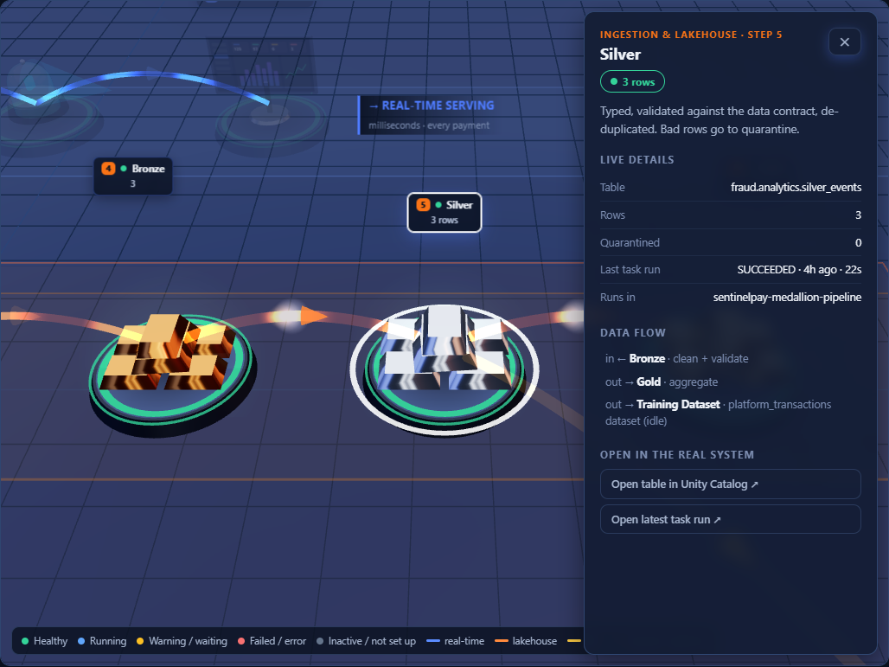
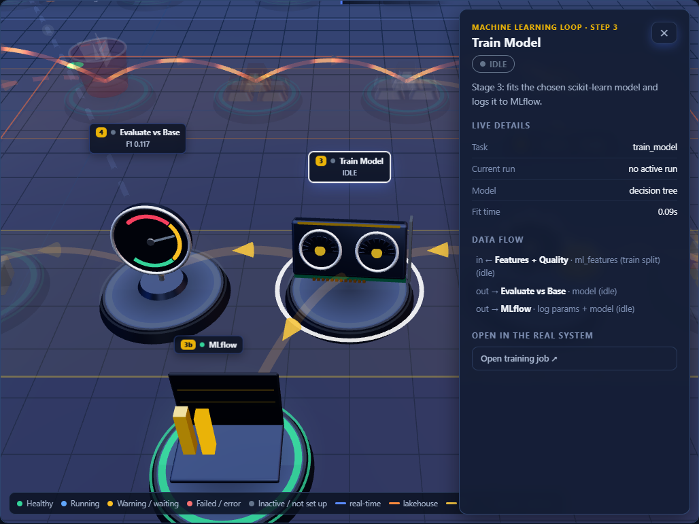
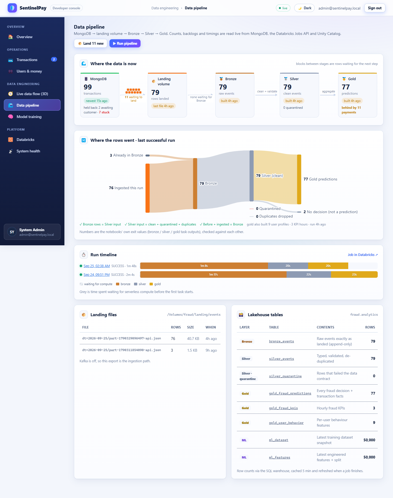

# SentinelPay: End-to-End Test Report and Improvement Strategy

| | |
|---|---|
| **Test date** | 25 September 2026 |
| **System under test** | SentinelPay (MERN banking app + FastAPI fraud engine + Databricks lakehouse and ML) |
| **Environment** | Local API `:4000`, user app `:5173`, admin console `:5174`, fraud engine `:8000`, MongoDB, Databricks Free Edition (serverless) |
| **Test type** | Real system, no mocks. Real users, real payments, real Databricks jobs, real MLflow runs |
| **How to repeat it** | `npm run dev`, then `npm run test:e2e` (see [section 8](#8-how-to-run-the-test-again)) |

---

## 1. Summary

The whole pipeline works from start to finish: a customer's payment is scored in real time, the data lands in the Databricks lakehouse, it is refined through Bronze, Silver and Gold, and new models are trained and compared with the live base model.

| Area | Checks | Passed | Failed | Result |
|---|---:|---:|---:|---|
| Setup (admin signs in, once per test part) | 2 | 2 | 0 | ✅ |
| User side (register → pay → decision → confirm/report) | 13 | 13 | 0 | ✅ Works |
| Developer side: users & money control | 9 | 9 | 0 | ✅ Works |
| Data pipeline (landing → Bronze → Silver → Gold) | 5 | 5 | 0 | ✅ Works |
| Model training (4 model/dataset pairs + safety check + MLflow check) | 6 | 5 | 1 | ⚠️ 1 failure, fixed and re-tested (see 5.1) |
| **Total (automatic API checks)** | **35** | **34** | **1** | |
| Interface check (8 admin pages + 3 user pages, desktop and phone, light and dark) | every page | all | 0 | ✅ No console errors |

**The one failure:** training on the public *credit-card benchmark* dataset failed. **Why:** Databricks Free Edition's serverless compute has no internet access, so the notebook could not download the dataset from openml.org. **Fix:** the API server now downloads it and puts it into the lakehouse for Databricks ([section 5.1](#51-f1-credit-card-benchmark-could-not-be-downloaded-fixed)).

**Other problems found and fixed during testing:** 5 (details in [section 5](#5-what-failed-or-went-wrong-and-why)).
**Known limitations that are not bugs, but matter:** 7 ([section 6](#6-known-limitations-honest-notes)).

---

## 2. What the system does (the pipeline under test)



The test followed this path in order: ① customers paying, ② the developer moving that data into the lakehouse, ③ training models on it and on other datasets.

---

## 3. How the test was run

1. **Automated end-to-end script** (`scripts/e2e.mjs`). It uses only the same API endpoints that the two apps use, and checks every answer.
2. **Browser test** (headless Chromium). Every admin page and the main user pages were opened at desktop width (1600 px) and phone width (390 px), in the light and dark themes. It counted console errors and failed requests, and checked that nothing overflows the screen.
3. **Real Databricks.** The data pipeline job and the training job ran on the Databricks workspace (`fraud` catalog). Results were read back from the Jobs API, Unity Catalog and MLflow.

Test data is clearly marked: users are named `E2E Customer 1…6` with emails `e2e-<timestamp>-N@sentinelpay.local`.

---

## 4. Results, step by step

### 4.1 User side ✅

Six new customers were created. Each made 12 payments of different kinds. Every payment went through the real fraud engine.

| Step | What we expected | What happened | Result |
|---|---|---|---|
| Register | account is created as *pending* | HTTP 201 | ✅ |
| Sign in before approval | refused | HTTP 403 "Your account is pending approval…" | ✅ |
| Admin approves, user signs in | works; opening balance | signed in, balance **$5,000** | ✅ |
| 48 ordinary payments (saved payee, home country, $20–260) | approved | **48 / 48 approved**, risk score 2 % | ✅ |
| 12 suspicious payments (unknown payee, abroad: NG / RU) | held for the user to confirm | **12 / 12 held** (score 67 %) | ✅ |
| 6 very risky payments (unknown payee, abroad, $2,100–2,600) | blocked | **6 / 6 blocked** (score 99 %) | ✅ |
| User confirms a held payment | money sent | 6 / 6 → COMPLETED | ✅ |
| User reports a held payment as fraud | blocked, money released | 6 / 6 → BLOCKED | ✅ |
| Ledger check (balance = start − sent, holds = 0) | consistent for every user | consistent for all 6 users | ✅ |
| Each payment stores the signals it was scored on | stored | e.g. `velocity1h 1, avgAmount30d 92.56, isNewBeneficiary false` | ✅ |

**Decisions in total (72 payments):** 54 approved · 12 held for review · 6 blocked. After the users answered, there were 13 fraud cases in the data (6 blocked + 6 reported + 1 blocked by the admin in 4.2). These later became the "fraud" labels for training.

In the user app, each payment now shows **"What happened to your payment"**: a small visual path (You → Signals → Fraud check → Decision → Data lake) with a step-by-step timeline under it. Every step comes from the real fields stored on the transaction.



### 4.2 Developer side: control of users and money ✅

| Action (admin console → Users & money) | Expected | Happened | Result |
|---|---|---|---|
| Credit $500 (reason required) | balance +500, user notified | $2,037.55 → $2,537.55, notification "Funds added" | ✅ |
| Debit $120 | balance −120 | → $2,417.55, notification "Funds withdrawn" | ✅ |
| Debit $10,000,000 | refused | HTTP 400 "Only $2417.55 is available" | ✅ |
| Adjustment without a reason | refused | HTTP 400 "A reason is required…" | ✅ |
| Set a daily limit | saved | $3,000 | ✅ |
| Block a held payment from the console | BLOCKED | BLOCKED | ✅ |
| Approve a held payment from the console | COMPLETED | COMPLETED | ✅ |
| User list shows balance and activity | shown | 6 test users with balances and payment counts | ✅ |

### 4.3 Data pipeline ✅

| Step | Result |
|---|---|
| **Landing** (admin console → Data pipeline → *Land*) | 76 settled transactions written as one NDJSON file (41.7 KB) to `/Volumes/fraud/landing/events/data/transactions/dt=2026-09-25/…`. Backlog afterwards: 0 |
| **Medallion job** (`sentinelpay-medallion-pipeline`) | **SUCCESS** in 2 min 23 s: Bronze 68 s → Silver 20 s → Gold 20 s |

Row counts, before and after:

| Table | Before | After | Note |
|---|---:|---:|---|
| `bronze_events` | 3 | **79** | 3 older rows + 76 new |
| `silver_events` | 3* | **79** | 0 rows quarantined by the data-quality rules |
| `gold_fraud_predictions` | 3 | **77** | Gold keeps rows that have a fraud decision; the 2 admin credit/debit entries have none, as designed |
| `gold_fraud_kpis` | 2 | 3 | hourly KPIs |
| `gold_user_behavior` | 3 | 9 | per-user profiles |

\* The "before" count for Silver briefly showed as *unknown*. That was caused by a Databricks API timeout, which is fixed now (see 5.2).

### 4.4 Model training

Every run executed the 4 real Databricks tasks: **load dataset → build features → train model → evaluate against the base model and register the new version**.

| # | Model | Dataset | Result | Time | F1 | PR-AUC (new vs base) | ROC-AUC (new vs base) | Registered |
|---|---|---|---|---:|---:|---|---|---|
| 1 | Logistic Regression | Platform transactions (our own lakehouse data, 77 rows) | ✅ COMPLETED | 3.2 min | 0.857 | 1.000 vs 1.000 | 1.000 vs 1.000 | v4 |
| 2 | Random Forest | Synthetic payments (50,000 rows) | ✅ COMPLETED | 3.1 min | 0.152 | **0.116 vs 0.073** | **0.785 vs 0.697** | v5 |
| 3 | Gradient Boosting | Synthetic payments (50,000 rows) | ✅ COMPLETED | 3.3 min | 0.129 | **0.144 vs 0.073** | **0.801 vs 0.697** | v6 |
| 4 | Naive Bayes | Credit-card benchmark (OpenML 1597) | ❌ FAILED at step 1 | 1.6 min | — | — | — | — |
| 4b | Naive Bayes | Credit-card benchmark (after the fix) | see [5.1](#51-f1-credit-card-benchmark-could-not-be-downloaded-fixed) | | | | | |

Safety check: starting training **without** explicit confirmation is refused (HTTP 400). Training never starts by itself.

**How to read these numbers (plain words):**
- **PR-AUC** is the most useful score here, because fraud is rare (2.4 % of the synthetic data). It measures how well the model ranks fraud above normal payments. Random guessing would score about 0.024.
- On the synthetic data, **both new models beat the live base model**: Gradient Boosting is about **2× better** (0.144 vs 0.073).
- **F1 is low (0.13–0.15)** because the models are trained with *balanced class weights*, so at the default cut-off of 0.5 they flag many payments. Recall is high (52–70 % of fraud found), but precision is low (7–9 %). Picking a better cut-off would raise F1; this is item S2 in the strategy.
- **Run 1's perfect scores do not mean the model is perfect**; see limitation L1. Its labels come from the base model's own decisions, and its test set has only 20 rows.

All runs are visible in MLflow (experiment `/Users/<you>/sentinelpay-fraud`). The Unity Catalog model `fraud.analytics.fraud_classifier` now has versions v1–v6. **No version is deployed to live scoring**: the base model still scores every payment, as designed (deployment is manual).

### 4.5 Interface check ✅

| What | Result |
|---|---|
| Admin pages: Overview, Transactions, Users & money, 3D Architecture, Data pipeline, Model training, Databricks, System health | 0 console errors · 0 failed requests · no horizontal scroll at 1600 px and 390 px |
| User app: Overview, Send money (real payment), Transactions | 0 errors · no horizontal scroll at 1440 px and 390 px |
| Light theme (new default) and dark theme | both render; the choice is remembered per browser |
| 3D architecture during a live training run | the view switched to the ML loop by itself, with the banner "Training is running on Databricks". Train Model was green and Evaluate blue, taken from the real Databricks task states |



Close-ups of the new realistic 3D models (bronze/silver ingots for the medallion tables; a GPU for training; a gauge showing the real ROC-AUC; an MLflow chart):

 

### 4.6 Data-flow monitoring (added after the test)

Because this is a data-engineering project, the console was reworked so that it shows **how the data moves**, not only that the services are up. The new endpoint `GET /admin/dataflow` reads only real sources: MongoDB, the Databricks Jobs API (runs, task times, notebook outputs) and Unity Catalog row counts.

| View | What it answers | Where |
|---|---|---|
| **Stage map** | How many rows are in MongoDB, the landing volume, Bronze, Silver and Gold; how many wait between stages; when each layer was last built; how far Gold is behind | Overview, Data pipeline |
| **Row reconciliation** (flow chart) | Where every row of the last successful run went (ingested, quarantined, duplicates, predictions), with 3 automatic checks | Data pipeline |
| **Run timeline** | How long each run took, split into *waiting for compute* and the bronze / silver / gold tasks | Data pipeline |
| **Payments per minute + scoring speed** | Throughput by outcome for the last hour; fraud-engine and whole-payment time (median, p95), now measured on every payment | Transactions |
| **Live 3D data flow** | Each payment pulses along its real path; orange block stacks on the floor are the rows waiting to land / waiting for Bronze, and grow when a payment arrives | Live data flow (3D) |
| **Training timeline + confusion matrix** | Where a training run's time went; caught / missed / false alarms on the test set | Model training |

Verified in a real browser against the live system: 0 console errors; the three reconciliation checks pass for the last run (3 already in Bronze + 76 ingested = 79 Bronze = 79 Silver input = 79 clean + 0 quarantined + 0 duplicates; 77 predictions + 2 events without a decision); a new payment raised the 3D "waiting to land" stack from 7 to 8 within a few seconds; no sideways scrolling at 390 px. Measured scoring speed: fraud engine 4 ms median, whole payment about 20 ms median.

**Removed as unnecessary:** the decorative banner pictures on every console page (replaced by a one-line header), the "Admin Console" node in the 3D view (it is the viewer, not part of the data flow), the switched-off Kafka nodes (they appear again when `KAFKA_ENABLED=true`), the guided walk-through (the stage list does the same job), and the 24-hour hourly charts on the pipeline page (replaced by the per-minute view on Transactions).



**What the monitor revealed right away:** see L8 and L9 below. Neither was visible in the old console.

---

## 5. What failed or went wrong, and why

| # | Problem | Why it happened | Status |
|---|---|---|---|
| F1 | Credit-card benchmark training failed (`URLError`) | Databricks Free Edition serverless compute **cannot reach the internet**, so `fetch_openml` could not download the data | ✅ Fixed (below) |
| F2 | For a few seconds the status could say "jobs not deployed" or "table not created" | When a Databricks API call timed out (8 s limit), the API treated "no answer" as "nothing there" and **cached that wrong answer** (20 s for jobs, 5 min for row counts) | ✅ Fixed |
| F3 | Model training page scrolled sideways on phones | the run-history table's card was inside a CSS grid cell that could not shrink below the table's width | ✅ Fixed |
| F4 | Overview said "Model: never trained" while a run was active | the card showed the empty text while the training data was **still loading** (that request is slow, see L5) | ✅ Fixed: shows "loading…" |
| F5 | The sidebar "Sign out" button was invisible in the new light theme, and the "payment sent" message showed two ✅ icons | a style clash between the white button style and the dark sidebar; the icon was added twice | ✅ Fixed |
| F6 | *(found by you, after the test)* The "Confirm this payment" popup would not close: "Not now", "Confirm payment" and "Report fraud" all left it on screen | the app re-opened the popup on every screen update while **any** payment was still waiting. "Not now" leaves the payment waiting, so it re-opened at once; after Confirm/Report the old list was still on screen until the reload finished, so it re-opened too. The automated test used the API directly, so it never clicked these buttons | ✅ Fixed: the popup only opens by itself for newly challenged payments; "Review" on the overview re-opens it. Re-tested in a real browser: closes after all three buttons, payments ended COMPLETED / BLOCKED |

### 5.1 F1: credit-card benchmark could not be downloaded (fixed)

- **Error seen:** `load_dataset FAILED: URLError`. The next 3 tasks were then skipped ("An upstream task failed").
- **Root cause:** the notebook called `sklearn.datasets.fetch_openml(1597)`, but Free Edition serverless compute has no outbound internet access.
- **Fix:**
  1. The admin console now shows a **"Stage into lakehouse"** button on this dataset.
  2. After confirmation, the API server (which does have internet) downloads the 69.8 MB Parquet file from openml.org **in the background**, with a progress bar, and uploads it to `/Volumes/fraud/landing/events/reference/creditcard/`.
  3. The notebook reads that file and caches it as the Delta table `ref_creditcard`.
  4. If the file is missing, the notebook stops with a clear message telling you to press that button.
- **Extra finding:** openml.org delivered only about **30 KB/s** during the test. That is why staging is a background job and not a normal request (the first version timed out after 5 minutes).
- **Re-test result:** *pending: filled in below when staging and the re-run finish.*

### 5.2 F2: status flicker on Databricks timeouts (fixed)

The API now remembers the last good answer. If Databricks does not answer in time, it shows the last known jobs and row counts, marked as stale. It retries after 10 seconds, instead of showing "not deployed" or empty tables.

---

## 6. Known limitations (honest notes)

These are not crashes, but they matter for anyone judging the results.

| # | Limitation | Why it matters |
|---|---|---|
| L1 | **Platform-data labels come from the base model itself.** A payment counts as "fraud" if it was blocked or reported, and blocks are decided by the base model's rules | A new model trained on this data mostly learns to copy the rules. That is why run 1 scored 1.0, **exactly like the base model**. Real improvement needs independent labels (confirmed fraud, chargebacks) |
| L2 | The platform dataset is tiny (77 rows, test set 20 rows) | Scores on 20 rows are not reliable. A few hundred labelled rows are needed |
| L3 | **The "30-day average amount" includes blocked and held payments** | After a fraudster's large attempts are blocked, the user's average rises, so later large payments look normal. In the test, $1,300–1,700 payments at home to a saved payee were approved with a 22 % score |
| L4 | **Money is stored as floating-point numbers** | Values such as `2037.5499999999997` appear inside the API. Banking amounts should be stored as whole cents |
| L5 | `GET /admin/training` is slow while a run is active | Every call also syncs with Databricks (runs/get + outputs). It should be a background worker |
| L6 | Trained models are registered but **not deployed** | By design (manual). Nothing yet moves a better model into live scoring safely |
| L7 | Free Edition limits | Only **one job run at a time** (others queue), no internet on serverless, and the first request after the SQL warehouse sleeps is slow (cold start) |
| L8 | **7 payments are stuck in `PENDING_RISK_CHECK`** (created 23–24 Sep, before this test) with their hold still placed | They were never scored, so they never settle and never reach the lakehouse. The likely cause is the old `decisionSource` enum bug (fixed in commit `122e567`) or an API restart in the middle of a payment: the payment is saved *before* scoring, and nothing cleans up if the request dies. Not reproduced, so the cause is not confirmed |
| L9 | Gold is only as fresh as the last manual pipeline run | The monitor shows "Gold is behind by N payments". Nothing runs landing and the medallion job automatically (S10) |

---

## 7. System improvement strategy

The suggestions are ordered by value for the effort. **Now** = days, **Next** = 1–3 weeks, **Later** = larger projects.

### 7.1 Data and labels (the most important)
| When | Improvement | Benefit |
|---|---|---|
| Now | **S1.** Compute the 30-day average only from *completed* payments (fixes L3) | fraudsters can no longer inflate their own baseline |
| Now | **S2.** Tune the decision threshold on a validation split and log it with the model (e.g. maximise F1, or fix recall at 80 %) | F1 rises with no new data |
| Next | **S3.** Collect independent labels: user "not me" reports, admin investigation outcomes, chargebacks → a `labels` table in Silver | ends label leakage (L1); models can then beat the rules in reality |
| Next | **S4.** Add a time-based train/test split for platform data | tests how the model does on *future* payments, like in real life |
| Later | **S5.** Feature store: the same feature code for training (Databricks) and serving (fraud engine) | no training/serving skew |

### 7.2 Machine learning lifecycle
| When | Improvement | Benefit |
|---|---|---|
| Next | **S6.** "Promote" button: set the UC alias `@champion` on a version that beats the base model; the fraud engine loads `models:/…@champion` | closes the loop from training to live scoring (L6) |
| Next | **S7.** Shadow mode: the new model scores every payment next to the base model, but only the base model decides; compare in Gold | safe evaluation on real traffic before switching |
| Later | **S8.** Drift monitoring (feature and score distributions per day, in Gold) with an alert, and scheduled retraining | the model stays accurate as behaviour changes |
| Later | **S9.** Explanations (top feature contributions) shown to the admin for each held/blocked payment | faster, fairer investigations |

### 7.3 Data engineering
| When | Improvement | Benefit |
|---|---|---|
| Now | **S10.** Schedule landing + medallion (e.g. every 15 min) instead of manual buttons | fresh data without clicks |
| Next | **S11.** Move Bronze/Silver/Gold to **Lakeflow Declarative Pipelines (DLT)** with expectations (data-quality rules as code) | built-in lineage, quality metrics and retries |
| Later | **S12.** Streaming path: switch on Kafka and the ingest bridge; consider MongoDB change streams (CDC) | seconds instead of minutes from payment to lakehouse |
| Now | **S21.** A sweeper that finds payments stuck in `PENDING_RISK_CHECK` for more than a minute, re-scores them (or fails them and releases the hold), and alerts (fixes L8) | no frozen money, no rows missing from the lakehouse |
| Next | **S22.** Freshness targets with alerts, e.g. "Gold at most 30 min behind", "no rows quarantined"; keep the reconciliation numbers per run in a Delta table | the monitor becomes an alarm, and history shows trends |

### 7.4 Reliability and correctness
| When | Improvement | Benefit |
|---|---|---|
| Now | **S13.** Store money as integer cents; use MongoDB transactions for balance + hold + ledger updates | exact amounts, no half-finished updates |
| Next | **S14.** A background worker syncs Databricks job state and pushes it over Socket.IO | fast pages (L5), fewer API calls |
| Next | **S15.** Retries with back-off on Databricks calls | fewer "unknown" states |

### 7.5 Security
| When | Improvement | Benefit |
|---|---|---|
| Next | **S16.** Use a Databricks **service principal** (OAuth) instead of a personal access token; keep it in a secret manager | least privilege, easy rotation |
| Next | **S17.** Audit log for every admin money adjustment and training/deploy action, stored in its own collection and landed to the lakehouse | traceability |
| Later | **S18.** Separate roles: support (view), operator (money), ML engineer (training) | fewer people can move money |

### 7.6 Testing and delivery
| When | Improvement | Benefit |
|---|---|---|
| Now | **S19.** Unit tests for the API (decision logic, ledger maths) and the fraud engine; add a real linter (ESLint, ruff) | catches bugs before they run |
| Next | **S20.** GitHub Actions: build + unit tests on every push; run `npm run test:e2e` (local phases) nightly | the checks in this report become automatic |

---

## 8. How to run the test again

```bash
npm run dev                                       # API + user app + admin console
E2E_PHASES=users,admin node scripts/e2e.mjs       # user + developer side only (no Databricks compute)
node scripts/e2e.mjs                              # everything, incl. landing, medallion job and 4 training runs
E2E_TRAIN=gradient_boosting:synthetic_payments node scripts/e2e.mjs   # choose the training runs
```
Results are written to `scripts/e2e-output/e2e-result.json` and `e2e.log` (not committed).
The full run uses Databricks serverless compute: about 2.5 minutes for the pipeline and 3–4 minutes per training run.

## 9. What the test left in the systems

| Where | What |
|---|---|
| MongoDB | 6 test users `e2e-…@sentinelpay.local` with 74 payments and 2 admin adjustments (kept, because their data is now in the lakehouse), plus two $120 payments made by browser-test users that were deleted afterwards |
| Databricks | 1 medallion run; 4 training runs (+ re-test runs); model versions v4–v6; Parquet file under `…/events/reference/creditcard/` |
| Git | the reusable test script `scripts/e2e.mjs`, this report, and the screenshots in `docs/report/` |
